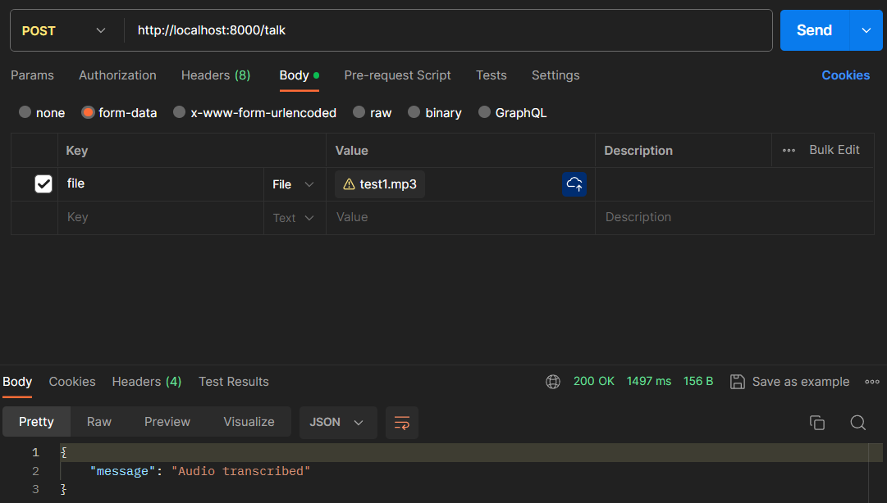

## Interview robot based on ChatGPT
ChatGPT acts as the interviewer / interviewee. It will reponse to you with realistic voice. Moreover, it can become your shadow that means you can transfer your personal info to it making it more akin to you.

## Pipeline
- speech2text function based on Whisper API
```
# you can create test audio track via:
https://online-voice-recorder.com/
```


- text2speech function
```
# you can transform text to speech via:
https://elevenlabs.io/
```

- ChatGPT uses chat history stored in your DB (MongDB or Json)


## project environment setup and test
- pip install
```
pip install -r requirements.txt
```

- create file .env (get from https://platform.openai.com/)
```
OPEN_AI_ORG=
OPEN_AI_KEY=
```

- GUI ([fastAPI](c:/Users/Steve/AppData/Local/Microsoft/Windows/INetCache/IE/JLD6YHZX/N8928GYB))
```
# start/reload the main file
uvicorn main:app --reload
# or 
http://127.0.0.1:8000/docs#/
```

## progressive

| Item                         | Progress   |
|------------------------------|-----------:|
|speech2txt                    |✅         |
|gpt response                  |✅         |
|personal shadow creation      |🕑         |
|txt2speech                    |🕑         |
|front-end gui                 |🕑         |
|various speech input          |🕑         |
|various speech voice output   |🕑         |